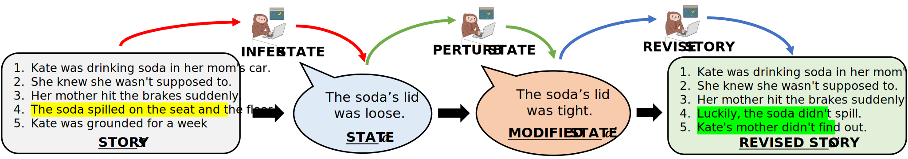

<u>**```PASTA```:A Dataset for Modeling Participant States in Narratives**</u>



- **Dataset**
    The train, validation and test dataset are in ```data/tr_data.jsonl```, `data/val_data.jsonl` and ```data/te_data.jsonl``` respectively. The fields in the data are:
    - **AssignmentId** - unique ID of a ```PASTA``` response
    - **Input.Title** - title of the story which is provided to the annotator for generating a ```PASTA``` response.
    - **Input.storyid** - unique (ROC story) ID of the input story.
    - **Input.line1** to **Input.line5** are the 5 stentences of the input story.
    - **Answer.assertion** - participant state inferred from the input story
    - **Answer.line1.on** to **Answer.line5.on** indicates which are the minimal set of story sentences based on which the annotator inferred the participant state.
    - **Answer.mod_assertion** - perturbed participant state that is counterfactual to the input story.
    - **Answer.mod_line1** to **Answer.mod_line5** are the sentences of the modified story that are consistent with the perturbed state.
<br>
- **Code - to be updated soon!!**