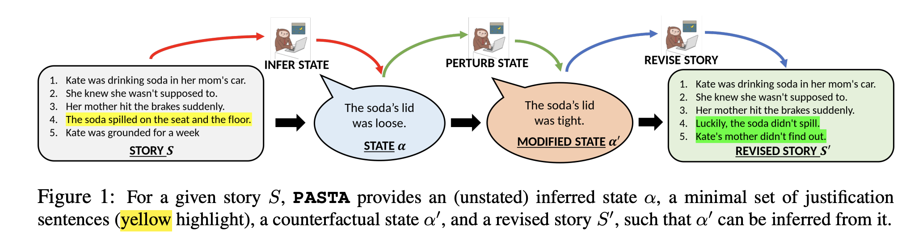

<u>**```PASTA```:A Dataset for Modeling Participant States in Narratives**</u>



- **Dataset**
    The train, validation and test dataset are in ```data/tr_data.jsonl```, `data/val_data.jsonl` and ```data/te_data.jsonl``` respectively. 
    The fields in the data are:
    - **AssignmentId** - unique ID of a ```PASTA``` response
    - **Input.Title** - title of the story which is provided to the annotator for generating a ```PASTA``` response.
    - **Input.storyid** - unique (ROC story) ID of the input story.
    - **Input.line1** to **Input.line5** are the 5 stentences of the input story.
    - **Answer.assertion** - participant state inferred from the input story
    - **Answer.line1.on** to **Answer.line5.on** indicates which are the minimal set of story sentences based on which the annotator inferred the participant state.
    - **Answer.mod_assertion** - perturbed participant state that is counterfactual to the input story.
    - **Answer.mod_line1** to **Answer.mod_line5** are the sentences of the modified story that are consistent with the perturbed state.
<br>
- **Tasks on ```PASTA```**

  - <b>Story-State Inference</b> <br>
   <br> Task 8 
    - Throughout the codebase, the ```task_id``` for this task is ```8```.
  
    - Finetuning BERT/RoBERTa (base/large)
    ```
    CUDA_VISIBLE_DEVICES=0 python ./code/modelling_BERT_RoBERTa.py \
    -task_list "8" \                  # taks id of this task, i.e. "8"
    -num_epochs 6 \                   # num of training epochs
    -eval_steps 1000 \                # training step after which val-set is evaluated
    -batch_size 16 \                  # training batch size
    -model_type "bert-base-uncased" \ # model type (bert-base/roberta-large etc.)
    -random_seed 1231 \               # random seed
    -lr 5e-6 \                        # Learning rate of AdamW optim
    -task8_setting "1" \              # "1" (default): make inference based on highlighted part of the story, "0" make inference based on entire story 
    -wt_decay 1e-6 \                  # weight decay of the AdamW optim
    > ./logs/bert-base-task8.log &
    ```

    - <u>Finetuning T5 (base/large)</u>
    ```
    python ./code/modelling_t5.py \
    -task_list "8" \            
    -num_epochs 7 \             # num of training epochs
    -eval_steps 1000 \          # training step after which val-set is evaluated
    -batch_size 16 \            # training batch size
    -model_type "t5-base" \     # model type (t5-base/t5-large etc.)
    -random_seed 0 \            # random seed
    -lr 1e-4 \                  # Learning rate of AdamW optim
    -wt_decay 1e-6              # weight decay of the AdamW optim
    ```
  - <b>Story Revision from Counterfactual/State Change Generation</b> <br>
  -    <br> Task 6 <br><br>
  -    <br> Task 7 


      - <u>Finetuning T5 (base/large)</u>
      ```
      CUDA_VISIBLE_DEVICES=1 nohup python ./code/modelling_t5.py \
      -task_list "7" \      # "6" (story revision task) or "7" (state change task)
      -num_epochs 2 \
      -eval_steps 1000 \
      -batch_size 12 \
      -model_type "t5-base" \
      -random_seed 0 \
      -lr 1e-4 \
      -wt_decay 1e-6 > ./logs/t5-base-task7.log &
      ```
        - GPT3 few-shot prompting code can be found in ```./code/gpt3_code.ipynb```<br><br>
       
  - Inference on validation/test set from a checkpoint<br>
  Code generates model prediction, saves it, and generate the automatic metric based on ground truth & model prediction.(acc/contrastive acc for classificaion, BERTscore for generation task)

    ```
    CUDA_VISIBLE_DEVICES=0 nohup python ./code/inference_T5.py \
    -task_list "6" \
    -model_type "t5-base" \
    -checkpoint "model_checkpoint_path (.pt)" \
    -task8_setting "1" > logs/_t5b_t_6_op.log &

    CUDA_VISIBLE_DEVICES=0 nohup python ./code/inference_BERT.py \
    -task_list "8" \
    -model_type "bert-base-uncased" \
    -task8_setting "1" \
    -checkpoint "model_checkpoint_path (.pt)" &
    ```

  - Human evaluation metric for the three ```PASTA``` tasks are computed in ```./code/human_eval.ipynb```. Human response based on which these metrics are computed is in ```./data/human_eval_dat.csv```